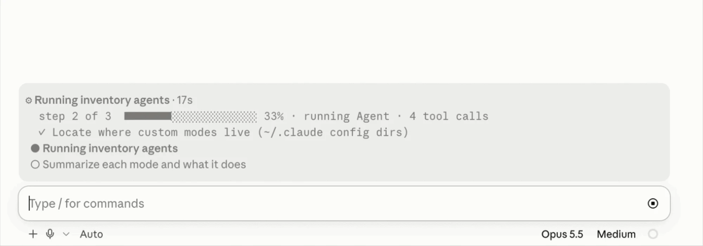

# claude-mods



Claude Code mods by Alessio Mercurio.

| Plugin | What it does |
| --- | --- |
| **workflow-radar** | Live view of what the model is doing (thinking, writing, tool calls, subagents) in the band above the prompt, plus a `plan` tool the model uses to track multi-step tasks. |
| **token-weather-v2** | A live forecast of the context window in the band above the prompt. |

## Install

In Claude Code:

```
/plugin marketplace add alessiomercurio/claude-mods
/plugin install workflow-radar@alessio-mods
/plugin install token-weather-v2@alessio-mods
```

## Develop

Each plugin lives in `plugins/<name>/`. Check and test one with:

```bash
claude plugin validate plugins/<name>
claude plugin test plugins/<name>
```

Bump `version` in the plugin's `.claude-plugin/plugin.json` (and in `.claude-plugin/marketplace.json`) when releasing an update.
